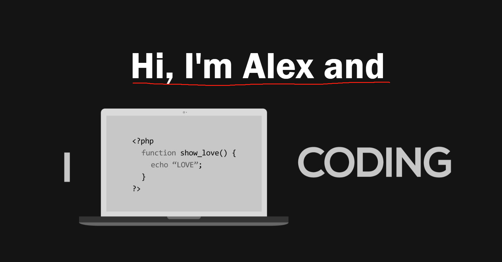
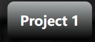
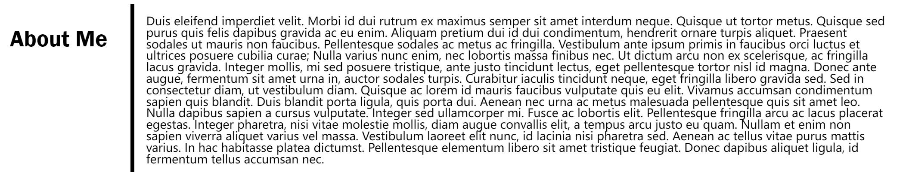
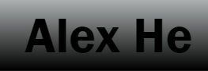
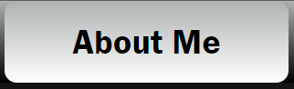
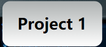
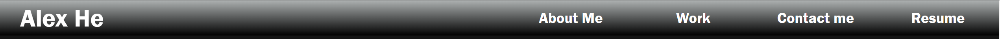

# Personal Profile Webpage

- [Description](#description)
- [Modification & Visulization](#modification---visulization)
  - [Static Text Color](#static-text-color)
  - [Active Text Color](#active-text-color)
  - [Static Background Color](#static-background-color)
  - [Active Background Color](#active-background-color)
  - [Transition Effect](#transition-effect)
  - [Add Contents](#add-contents)
- [Contributing](#contributing)
- [License](#license)

## Description

> This is a template for a personal profile webpage designed using HTML and CSS.
>
> The reason to use only CSS to style is because it makes this template easy to customize into your own personal profile webpage.

> This template personal profile page contains following sections:
>
> - **About me**: a brief introduction about yourself
> - **Work**: Here is where you showcase your work, employers can click on the links going to each deployed application
> - **Contact me**: Here is where you put your contact including email, github, linkedin, facebook, youtube and instagram

> Also when view from smaller viewport, website will responsively auto-adjust its content

[Back to Top](#personal-profile-webpage)

## Modification & Visulization

#### [Click here](https://hmhtom.github.io/module2-personal-profile/) to visulize the template webpage.

### Static Text Color

> Text colors for following:
>
> - Header Title
> -  Navigation button text
> -  Intro text
> -  Work title text
> -  Footer Text
>
> Can be changed from `:root {--global-text-color: <color>;}`

> Text color for title and text for main content
> 
>
> Can be changed from
> `:root {--content-text-color: <color>;}`

### Active Text Color

> Text color for header title, navigation buttons and project title when they are active or hovered:
>
> 
> 
> 
>
> Can be changed from
> `:root {--content-text-color: <color>;}`

[Back to Top](#personal-profile-webpage)

### Static Background Color

> Header and footer background color with linear-gradient effect
>  > 
>
> Can be changed from `:root {--header-bgcolor: linear-gradient(<color1>, <color2>);}`

> Work content title back ground color with linear-gradient effect 
>
> Can be changed from `:root {--work-title-bgcolor:linear-gradient(<color1>, <color2>);}`

> Main content background color:
> 
>
> Can be changed from: `:root {--main-content-bgcolor: <color>;}`

### Active Background Color

> Navigation button and work title background hover effect:
>
> 
> 
>
> Can be changed from `:root{--navbutton-bgcolor-hover:linear-gradient(<color1>, <color2>);}` and
>
> `:root{--work-title-bgcolor-hover:linear-gradient(<color1>, <color2>);}`

### Transition Effect

> Transition effect delay for nav-button, work-content and contact me icon can be change from
>
> `:root{--transition: all <time in second>;}`
>
> Default value set to 0.5s.

[Back to Top](#personal-profile-webpage)

### Add Contents

You can add your own content of the page inside index.html

> Resume

```
line 17:  <a href="#">Resume</a>
```

> Intro Text

```
line 22: <h2>Hi, I'm Alex and</h2>
```

> About me

```
line 26 <p class="section-content">
        ...Add content here
line 52 </p>
```

> Work link and cover picture

```
line 57: <section class="section-content" id="work-content">
            <a href="#" id="first-enlarge"
                >
                <h3 class="work-title">Project 1</h3></a
            >
            <a href="#"
                >
                <h3 class="work-title">Project 2</h3></a
            >
            ......
line 82: </section>
```

> Contact me links

```
line 87: <section class="section-content" id="contact-me-content">
            <a href="mailto: abc@example.com"
            ...
line 108 </section>
```

[Back to Top](#personal-profile-webpage)

## Contributing

Pull requests are welcome. For major changes, please open an issue first to discuss what you would like to change.

## License

[MIT](https://choosealicense.com/licenses/mit/)


[Back to Top](#personal-profile-webpage)
